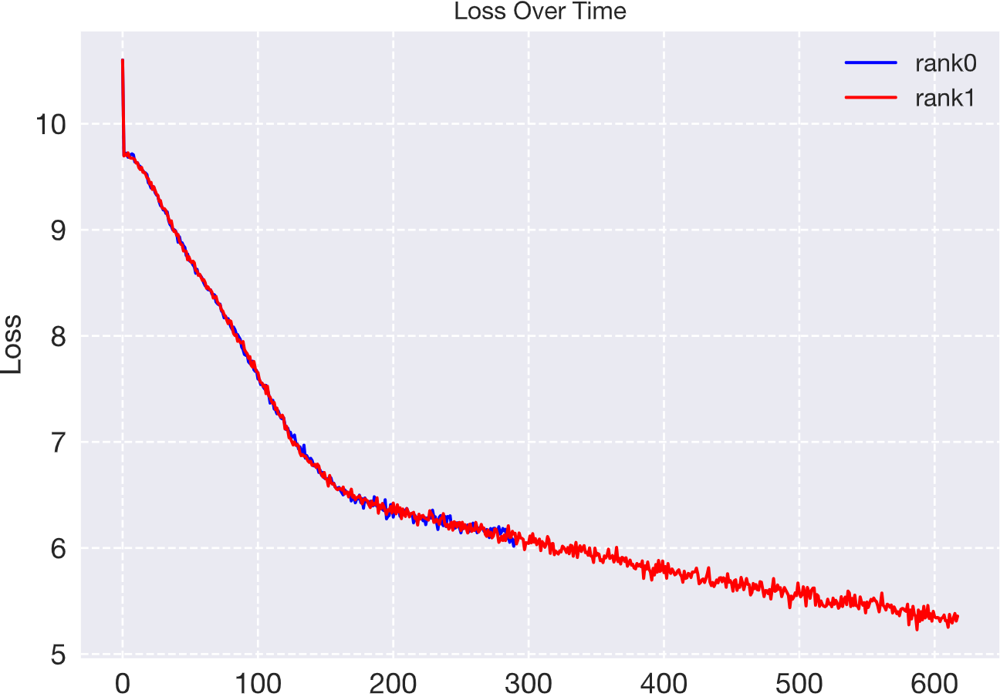

# GIWS  
**Give It a Whirl: Best Practices for PyTorch Training from Scratch**

> 📘 This README is also available in [Chinese (简体中文)](README_cn.md).

Welcome to the **GIW (Give It a Whirl)** repository! This is a PyTorch training template built on top of the **Hydra configuration system**, designed to provide beginners and researchers with a **clean, flexible, and extensible** project structure. The repository includes training implementations of various classic models and supports **both single-GPU and multi-GPU training**. The goals of this project are to:

- Provide standard implementations of common PyTorch models as learning references
- Demonstrate best practices in organizing and modularizing training code
- Leverage [Hydra](https://hydra.cc/docs/intro/) for simple and efficient configuration and experiment management

If you're learning PyTorch or looking for a reliable framework to start your experiments — **give it a whirl!**

## Getting Started

```sh
git clone git@github.com:tsyhahaha/Giws.git
cd Giws
pip install -e .
```

### 1. Train with an Existing Model

Configure training parameters in `config/xxx.yaml`, and update the config file name in `run_train.sh` accordingly:

```sh
torchrun \
    --nnodes=1 \
    --master-port=29505 \
    --nproc_per_node=1 \
    ./train.py \
    --config-name xxx(.yaml)
```

Then start training by running:

```sh
bash run_train.sh
```

For single-GPU training, simply set --nproc_per_node=1.For multi-GPU training (e.g., using 4 GPUs), set --nproc_per_node=4, and make sure to update the following in the config file accordingly:

```yaml
gpu_list: [0,1,2,3]
```


### 2. Customize Your Own Model

**Step 1: Implement Your Model**

Create a new file `xxx.py` under the `giws/models/` directory and define your model there.
 Then register it in `giws/models/__init__.py`:

```python
from giws.models.xxx import xxx
```

**Step 2: Implement a Training Function**

Create a new file `train_xxx.py` under `giws/trainer/` and implement a `train()` function.
 Refer to existing trainers for how to implement key components such as `setup_model()`, `setup_dataset()`, etc.
 If you want to support multi-GPU training with data parallelism, check out the `train_transformer.py` example.

**Step 3: Add Configuration Files**

Create a new config file `train_xxx.yaml` in `giws/config/` for training-related parameters.
 Create another config file `xxx.yaml` in `giws/config/model/` for model initialization parameters.

**Step 4: Begin Training**

Import your custom training function in `giws/train.py`:

```python
from giws.trainer.train_xxx import train as train_func_xxx
```

Add a new condition in the `main()` function:

```python
elif target == "xxx":
    train_func_xxx(cfg)
```

Finally, update the config file name in `run_train.sh` to match your custom config, and you’re ready to train.

### 3. Plotting Curves

To visualize training metrics such as loss and accuracy, you can use the `analysis/plot.py` script to generate trend curves. For example, to plot the training loss of the Transformer model, run:

```sh
python analysis/plot.py --model transformer --indicator loss
```

The script will automatically retrieve the latest training log, extract the loss values, and generate the corresponding plot, as shown below:



## Projects

This repository includes implementations of the following projects:
* Handwritten digit recognition on MNIST using CNN
* Image classification on CIFAR10 using ViT
* Chinese poem generation using LSTM
* Chinese-English translation using Transformer

## TODO list
- [ ] imgs about training results of each project in `docs/`
- [ ] details of environment build methods(both pipenv/conda)
- [ ] more training-friendly project structure and code organization
