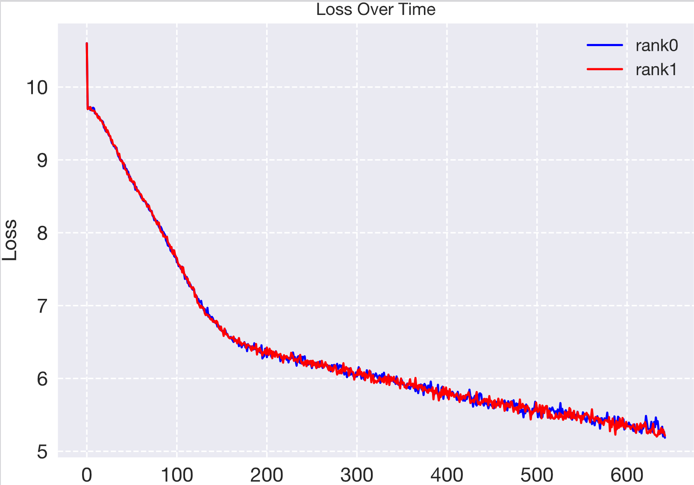

# GIWS
**Give It a Whirl：从零开始的 PyTorch 训练最佳实践**

欢迎来到 **GIW（Give It Whirls）** 仓库！这是一个基于 **Hydra 配置管理系统** 的 PyTorch 训练模板，旨在为初学者和研究者提供一个 **清晰、灵活、易扩展** 的项目结构。仓库中实现了多种经典模型的训练，并支持 **单卡和多卡训练**。这个项目的目标是：

- 提供 PyTorch 常见模型的标准实现作为学习参考
- 展示训练代码的规范组织方式与模块化设计
- 结合 [Hydra](https://hydra.cc/docs/intro/)，实现简洁高效的配置管理与实验控制

如果你正在学习 PyTorch，或想要一个可靠的训练框架作为起点，**那就 Give It a Whirl 吧！**

## 开始

```sh
git@github.com:tsyhahaha/Giws.git
cd Giws
pip install -e .
```

#### 1.使用现有模型

在`config/xxx.yaml` 中配置训练所需参数，将 `run_train.sh` 中的配置文件名改为对应文件名：

```sh
torchrun \
    --nnodes=1 \
    --master-port 29505 \
    --nproc_per_node=1 \
    ./train.py \
    --config-name xxx(.yaml)
```

即可通过指定配置文件启动训练：

```sh
bash run_train.py
```

若为单卡训练，设置 `--nproc_per_node=1` 即可；多为多卡训练（假设使用四张卡），则设为 `--nproc_per_node=4`，同时需要在 config 文件里设置：

```yaml
gpu_list: [0,1,2,3]
```

#### 2.自定义模型

**Step1：模型实现**

在 `giws/models/` 目录下新建 `xxx.py`，实现自定义模型。然后在 `giws/models/__init__.py` 中添加导入语句：

```py
from giws.models.xxx import xxx
```

**Step2：训练函数实现**

在 `giws/trainer/` 目录下新建 `train_xxx.py`，实现对应的 `train()` 函数。参考现有的 trainer 文件，依次实现 `setup_model()`、`setup_dataset()` 等函数。若希望支持多卡数据并行训练，可参考 `train_transformer.py` 的实现。

**Step3：添加配置函数**

在 `giws/config/` 下新建 `train_xxx.yaml`，配置训练流程相关参数。在 `giws/config/model/` 下新建 `xxx.yaml`，配置模型初始化所需参数。

**Step4：开始训练**

在 `giws/train.py` 中引入自定义训练函数：

```py
from giws.trainer.train_xxx import train as train_func_xxx
```

并在主函数中添加分支：

```py
elif target == "xxx":
    train_func_xxx(cfg)
```

最后，修改 `run_train.sh` 中的配置文件名，使用你新添加的配置，即可启动训练。

#### 3.绘制图像

对于训练过程中的指标（如 loss 和 accuracy），可以使用 `analysis/plot.py` 脚本绘制变化曲线。例如，若要绘制 Transformer 模型的训练损失曲线，可运行以下命令：

```sh
python analysis/plot.py --model transformer --indicator loss
```

脚本将自动读取最新的日志文件，提取训练损失数据并绘制图像，如下所示：



## 项目

本仓库实现的项目包括：
* 基于 CNN 的 MINST 手写数字图片识别
* 基于 ViT 的 CIFAR10 图片分类
* 基于 LSTM 的中文古诗生成
* 基于 Transformer 的中英文翻译

